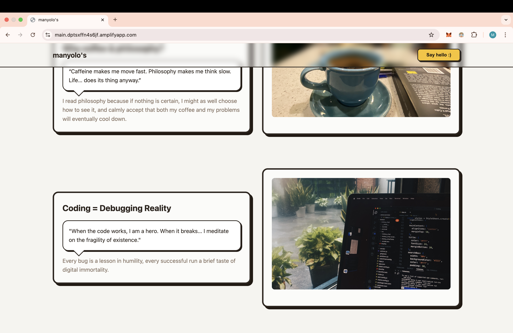
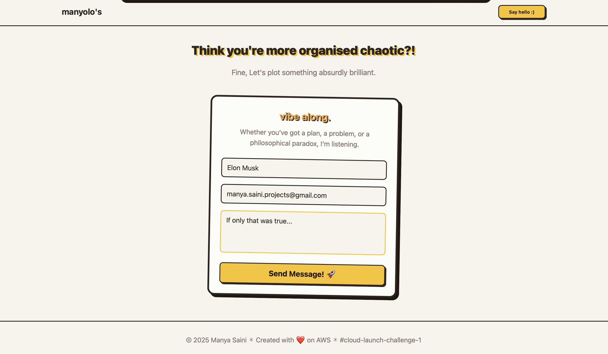

# Because Portfolios Are Too Mainstream: Architecting ‘Not a Portfolio’ on AWS at the AWS Builder Challenge

This week was all about **getting hands-on with different AWS services** - starting small, experimenting with the Free Tier, and layering security, scalability, and automation along the way. Step by step, I learned how these services connect, how to avoid rookie mistakes , and how to build something lightweight yet professional.

#### 🎯  Here's the website deployed using AWS Amplify : https://main.dptsxffn4s6jf.amplifyapp.com/

#### 🎯  Here's the AWS Builder Article : https://builder.aws.com/content/31hXlqsngOCrdv5ThSQUdFOcJ7D/because-portfolios-are-too-mainstream-architecting-not-a-portfolio-on-aws-at-the-aws-builder-challenge

 
## Day 1 – Setting Up the AWS Free Tier Account

**What I Did:**

- Signed up for AWS Free Tier
    
- Secured the account with **MFA (Multi-Factor Authentication)**
    
- Created a budget alert to stay mindful of Free Tier limits
    
- Created an **Admin IAM user** instead of using the root account
    

**Key Learnings:**

- **Budget Alerts**: Cloud services are pay-as-you-go, which is awesome, until you forget to “go” and the meter runs. Budget alerts prevent that. Cloud learning should be exciting, not financially stressful.
    
- **MFA (Multi-Factor Authentication)**: AWS accounts hold serious value - keys, IAM policies, workloads. A leaked password without MFA = instant compromise. MFA makes brute-forcing useless.
    
- **Root vs Admin**: Root account = master key. Admin IAM = scoped keys you can rotate, monitor, and revoke. Always use an **Admin IAM user**, not the root account. 
    
**Aha! Moment:**  
I stopped thinking like “just a user” and started thinking like an **owner**. Every decision -storage, design, deployment, now gets filtered through two lenses: **budget and security**.

**Tips for Future Builders:**

- ✅ Set up a budget alarm before you spin up your first resource
- ✅ Lock your root account with MFA and don’t use it casually
- ✅ Think like an engineer + accountant: skills + cost-awareness

## Day 2 – Creating a Secure S3 Bucket

**What I Did:**

- Created a private S3 bucket
    
- Learned why buckets should be private by default
    
- Uploaded files (including a personal image)
    
- Explored ACLs, bucket policies, and block-public-access settings
    
- Organized files in proper folder structure
    

**Why S3 for Websites?**  
S3 is:

- Highly durable (11 9’s durability = almost indestructible)
    
- Cost-effective (Free Tier = perfect for experiments)
    
- Simple to integrate with CloudFront for global delivery
    
- Static hosting-ready out of the box
    

**Key Learnings:**

Security-first design clicked here. Realizing that S3 is private by default taught me the philosophy of AWS: **open things only when they need to be open.**

- Organizing folders is crucial: in large-scale apps, you rely on **prefixes** for lifecycle rules and cost optimization.
**Tips for Future Builders:**

- ✅ Always keep buckets private, use CloudFront for public access
    
- ✅ Learn IAM policies early—they’re everywhere in AWS
    
- ✅ Start organizing folders from day one

##  Day 3 – Making the Website

**What I Did:**

- Built my website purely in **HTML + CSS**, keeping it light for Free Tier
    
- Decided not to create a “standard portfolio” (too heavy, too common)
    
- Focused on a theme that reflects **discipline + chaos**—my philosophy

**The Page’s Philosophy:**  
Life works like code: structure helps, but chaos is inevitable. My site embraces this balance.

**Key Learnings:**

- Simplicity helps with performance—no JS frameworks = instant load.
- A small site can tell a story if the design is intentional.
    

**Aha! Moment:**  
As a MERN developer, dropping down to bare HTML felt refreshing, like lifting weights with no fancy machines, just raw basics.

**Tips for Future Builders:**

- ✅ Don’t over-engineer. Use the Free Tier to focus on **core principles**
- ✅ Your theme should be _yours_, stand out from the template
- Don’t underestimate plain HTML—it’s fast, cheap, reliable

##  Day 4 – Global Distribution

**What I Did:**

- Connected S3 with CloudFront
    
- Deployed with global edge caching
    
- Enforced HTTPS with ACM certificates
    

**Key Learnings:**

- Latency is physics - you can’t beat the speed of light, but CDNs cheat it by caching closer to users.
    
- CloudFront isn’t just speed, it’s security (DDoS protection, HTTPS enforcement).
    

**Aha! Moment:**  
I learned CloudFront caches responses at the **edge locations** for a default TTL (Time To Live). Without cache invalidation, outdated assets might linger globally. That’s why **cache behaviors** (per path) and invalidations are key for version control at scale.

**Tips for Future Builders:**

- ✅ Always enable HTTPS, it’s free and improves SEO
    
- ✅ Use cache behaviors to control what gets cached (HTML vs images vs CSS)

##  Day 5 – Professional Deployment

**What I Did:**

- Migrated code storage from S3 → GitHub
    
- Integrated AWS Amplify for CI/CD
    
- Enabled automatic redeployments
    

**Why GitHub + Amplify Beat S3 Manual Uploads:**

- S3 doesn’t version HTML files properly, you overwrite the file, and the old one is gone.
    
- As developers, we constantly iterate. Without version control, debugging is impossible.
    
- GitHub tracks history, Amplify automates redeployment = less time babysitting infra, more time coding.
    

**Key Learnings:**

- CI/CD pipelines prevent human error.
    
- Amplify = production-grade deployment with Free Tier simplicity.
    

**Aha! Moment:**  
I discovered Amplify hooks directly into GitHub webhooks. That means **a git push triggers a build pipeline with pre-build, build, and post-build phases**. It’s literally DevOps “for free”, and made me think about how enterprise teams structure CI/CD pipelines.

##  Day 6 – Contact Form & Pub-Sub Architecture

**What I Did:**

- Built a contact form with Lambda backend
    
- Used SNS (Simple Notification Service) for pub/sub
    
- Configured IAM roles for security
    
- Sent email notifications on submissions
    

**Why It Was My Favorite:**  
I love backend design, this was a mini system design challenge. Using SNS decouples producers (form submissions) from consumers (email notifications).

**Key Learnings:**

- **Event-driven architecture** = scalable by design
- **Decoupling** makes systems more fault-tolerant
    

**Aha! Moment:**  
Realizing that even a simple form can showcase **enterprise-grade design principles**.
I learned SNS doesn’t just do fan-out, it supports multiple protocols (HTTP, Lambda, SQS, email). That means the same event (form submission) can trigger **multiple consumers in parallel**. It’s a simple form today, but the same architecture powers large-scale microservices.

**Tips for Future Builders:**

- ✅ Don’t connect services directly, decouple with SNS/SQS
- ✅ Practice IAM scoping early, it’s the hardest but most important part

 **My Innovative Use Case**

To be honest, this isn’t about building a big, world-changing use case. It’s more of a reminder, about balancing order and chaos. Instead of making a typical "about me" or portfolio page, I wanted to create something that gives visitors a real glimpse into my life. It’s personal, a little unconventional, and that’s exactly the point.
##  Final Reflection

The AWS Builder Challenge wasn’t about spinning up services, it was about building with **intent**.  
Security, budget, creativity, and discipline, all mattered equally.  AWS Free Tier is surprisingly generous when you know how to combine services smartly.
And through it, I didn’t just create a website.  
I created **a site that tells my story while living entirely on the Free Tier.**

Onto the next challenge !

Cheers. 
Manyolo. :)

